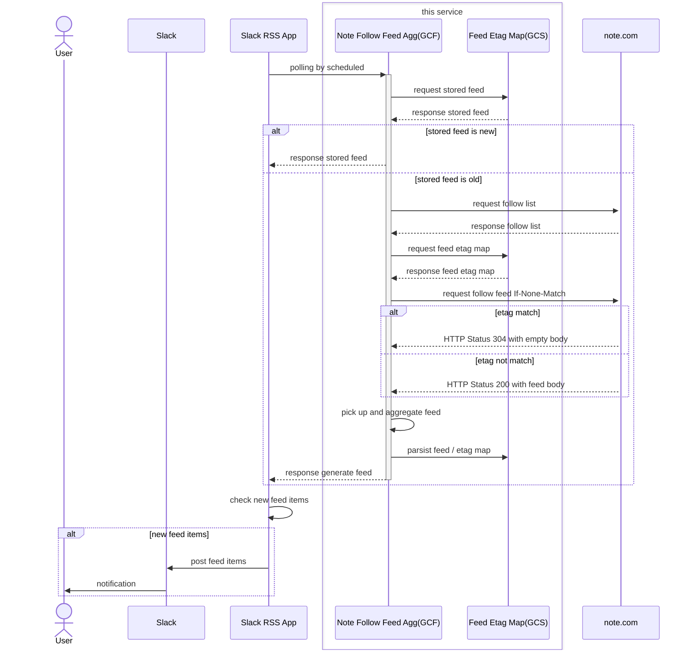

## note.com Follow Feed アグリゲーター

-   概要
    -   note.com でフォローしているユーザーの RSS を集約生成
    -   Google Cloud Functions の利用を想定
-   機能
    -   note.com の指定クリエーターのフォロー一覧を取得
    -   フォローユーザーの RSS の更新を確認
    -   更新のあったユーザー RSS のうち現在から 1 時間以内のエントリのみピックアップ

## 処理シーケンス

## 利用方法

https://{デプロイ URL}?creator_id={note_creator_id}
